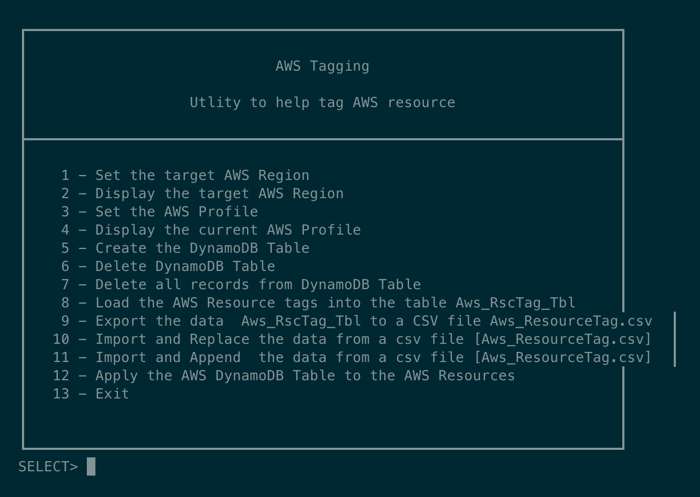

### AWS tagging

Complete this coding assignment. Ask questions if you need ideas

Company-X Sample Project Engagement Need Statement 
1.    Introduction
This document describes the requirements and needs of a customer that we will refer to as Customer-X. The objectives include the following:
·      design, develop and propose a technical solution
·      document the solution architecture
·      develop an executable (code) solution 
·      identify risk of 
·      estimate the time allocation for the solution tasks

2.    Audience  
The intended audience for this document is the Chief Technology Officer/Leadership team and the IT Project Managers. 
 Each IT Project manager has a set of AWS resources that they are responsible for managing the operations, monitoring the performance, and the associated costs.
 The CTO wants a solution that can be leveraged across their enterprise to allow Company-X to rapidly acquire other firms and incorporate the AWS resources of these newly acquired firms into the Company-X AWS portfolio.
 The CTO wants an enterprise solution that is easy to implement and focuses on Security, Reliability, Performance Efficiency, Cost Optimization, and Operational Excellence. 

3.    Company-X needs
Company-X  provides a complete product portfolio for 16,000 enterprise customers. Many of Company-X’s customers are in the Fortune 1000 suite of enterprise firms.  Company-X  provides software-as-service solutions that allow their customer to run the day-to-day operations and grow their business for the long-term. The Company-X portfolio includes back-office functions like HR, Supply chain, inventory management, and financials.
 Company-X has 40,000 AWS Resources (see list) that are in one of three states:  
&nbsp;&nbsp;&nbsp; 1. AWS resources that are missing AWS resource tags or   
&nbsp;&nbsp;&nbsp; 2. AWS resources that are incorrectly tagged or  
&nbsp;&nbsp;&nbsp; 3. AWS resources are both are missing some tags and need to be re-tagged
 
4.    AWS Proposed SOW  
AWS has proposed a 15 engagement to assist the customer with a comprehensive  tagging solution that   
·      Assist Customer with AWS resource  tagging strategy including  
·      Naming and AWS Resource  Tagging Strategy  
·      Best practices for AWS Resource  tagging  
·      An automated resource  tagging  utility (script) shall be design and developed to assist with AWS Resource  tagging process

5.    Solution Overview   
Inventory of all the resources in an AWS account is captured in dynamodb table. Then user can export the data, update resource tags and apply the changes.  
The code is written in Python using AWS boto3 library  
 

6.    Outcomes   
At the completion of this project, you have an intimate knowledge of the following:  
·       the request/response pattern of the AWS SDK  
·       the AWS Resource hierarchy and access patterns  
·       knowledge of AWS DynamoDB Tables, Indexes, and queries  
·       executable code on your laptop that leverages AWS Resources   
 

7.    List of AWS Resources  
This is the list of AWS Resources that we need to collect, store, modify, re-apply new tag values.  
·       "vpc"  
·       "image"  
·       "subnet"  
·       "route-table"  
·       "snapshot"  
·       "instance"  
·       "security-group"  
·       "volume"  
·       "customer-gateway"  
·       "dhcp-options"  
·       "internet-gateway"  
·       "network-acl"  
·       "network-interface"  
·       "reserved-instances"  
·       "spot-instances-request"  
·       "vpn-connection"  
·       "vpn-gateway"  
 

8.    User Guide  
The solution provides the menu so that user can manage the resource tags using following steps   
&nbsp;&nbsp;&nbsp; 1. Create dynamodb table to store all the resource info  
&nbsp;&nbsp;&nbsp; 2. Gather all the resources in the AWS Account and store it in dynamodb table along with existing tags  
&nbsp;&nbsp;&nbsp; 3. Export the resource info to csv file  
&nbsp;&nbsp;&nbsp; 4. Update the csv file with updated tags for each resource  
&nbsp;&nbsp;&nbsp; 5. Import the updated csv to dynamodb table  
&nbsp;&nbsp;&nbsp; 6. Apply the tags to the resources as specified in the imported csv  

9.  Application Menu   

